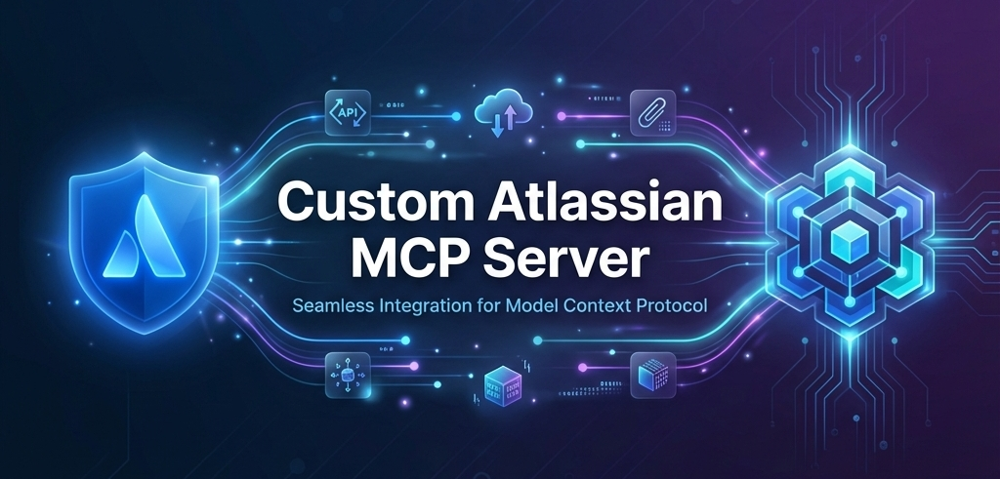

# Custom Atlassian MCP Server

[](https://modelcontextprotocol.io/)
[](https://opensource.org/licenses/ISC)
[](https://nodejs.org/)

A production-ready [Model Context Protocol (MCP)](https://modelcontextprotocol.io/) server that provides seamless integration with Atlassian Jira Cloud. This server enables AI assistants and MCP clients to fetch issue attachments, download attachment content, and interact with Jira data through a standardized interface.

## Features

- **Attachment Metadata Retrieval**: List all attachments for any Jira issue with metadata (ID, filename, MIME type)
- **Batch Attachment Downloads**: Download multiple attachment files in parallel with automatic base64 encoding
- **Production-Grade Error Handling**: Comprehensive error handling for network failures, API errors, and edge cases
- **Environment Validation**: Automatic validation of required credentials at startup
- **Stdio Transport**: Standard input/output communication for cross-platform compatibility
- **Parallel Processing**: Efficient batch operations with concurrent API requests

## Prerequisites

- **Node.js**: Version 18.x or higher
- **Jira Cloud Account**: With API access enabled
- **Jira API Token**: [Generate one here](https://id.atlassian.com/manage-profile/security/api-tokens)

## MCP Client Setup

To use this MCP server, you need to configure your MCP client (e.g., Claude Desktop, Cursor IDE, or other MCP-compatible clients).

### Configuration File

Add the following configuration to your MCP client's settings file:

**For Cursor IDE** (`.cursor/mcp.json`):

```json
{
  "mcpServers": {
    "custom-atlassian-mcp": {
      "command": "npx ts-node /path/to/custom-atlassian-mcp/server.ts",
      "args": [],
      "env": {
        "JIRA_DOMAIN": "your-organization.atlassian.net",
        "JIRA_EMAIL": "your-email@example.com",
        "JIRA_API_TOKEN": "your-api-token-here"
      }
    }
  }
}
```

### Verifying the Connection

After configuration:

1. Restart your MCP client
2. The server should appear in your client's MCP servers list
3. You should see the available tools: `jira_get_issue_attachments` and `jira_get_attachment_image`

---

## Local Development Setup

If you want to modify or contribute to this project, follow these steps to set up your local development environment.

### 1. Clone the Repository

```bash
git clone https://github.com/studcroc/custom-atlassian-mcp.git
cd custom-atlassian-mcp
```

### 2. Install Dependencies

```bash
npm install
```

### 3. Configure Environment Variables

Create a `.env` file in the project root. Take reference from the `.env.template`

### 4. Run the Server

Start the MCP server:

```bash
node server.ts
```

## Available Tools

### 1. `jira_get_issue_attachments`

Retrieves metadata for all attachments associated with a Jira issue.

**Input Schema**:

```typescript
{
  issueId: string; // Jira issue key (e.g., "PROJ-123")
}
```

**Response**:

```json
[
  {
    "id": "10001",
    "mimeType": "image/png",
    "filename": "screenshot.png"
  },
  {
    "id": "10002",
    "mimeType": "application/pdf",
    "filename": "requirements.pdf"
  }
]
```

**Use Cases**:

- List available attachments before downloading
- Check file types and names
- Prepare for bulk downloads

**Error Handling**:

- Returns error message for HTTP errors (4xx, 5xx)
- Handles network failures gracefully
- Returns empty array if issue has no attachments

---

### 2. `jira_get_attachment_image`

Downloads and returns the binary content of Jira attachments as base64-encoded data.

**Input Schema**:

```typescript
{
  attachmentIds: string[]  // Array of attachment IDs
}
```

**Response**:

```typescript
{
  content: [
    {
      type: "image",
      data: "<base64-encoded-content>",
      mimeType: "image/png",
    },
  ];
}
```

**Use Cases**:

- Display attachment images in UI
- Download multiple attachments efficiently
- Process attachment content programmatically

**Error Handling**:

- Silently skips attachments that fail to download
- Returns successful downloads even if some fail
- Returns empty array if all attachments fail

## Contributing

Contributions are welcome! Please follow these guidelines:

1. Fork the repository
2. Create a feature branch (`git checkout -b feature/amazing-feature`)
3. Commit your changes (`git commit -m 'Add amazing feature'`)
4. Push to the branch (`git push origin feature/amazing-feature`)
5. Open a Pull Request

## Support

For issues, questions, or contributions:

1. **Issues**: Open an issue in the repository
2. **Documentation**: Refer to the [MCP Documentation](https://modelcontextprotocol.io/)
3. **Jira API**: See [Atlassian Developer Documentation](https://developer.atlassian.com/cloud/jira/platform/rest/v3/)
